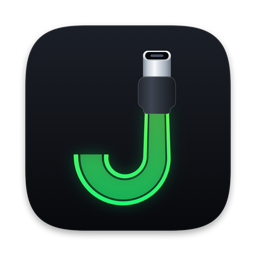
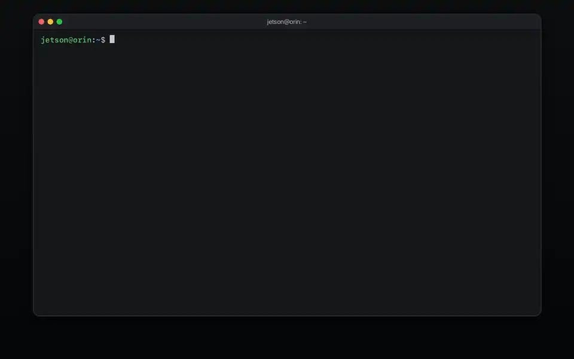
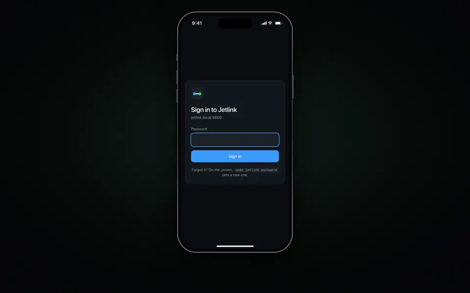
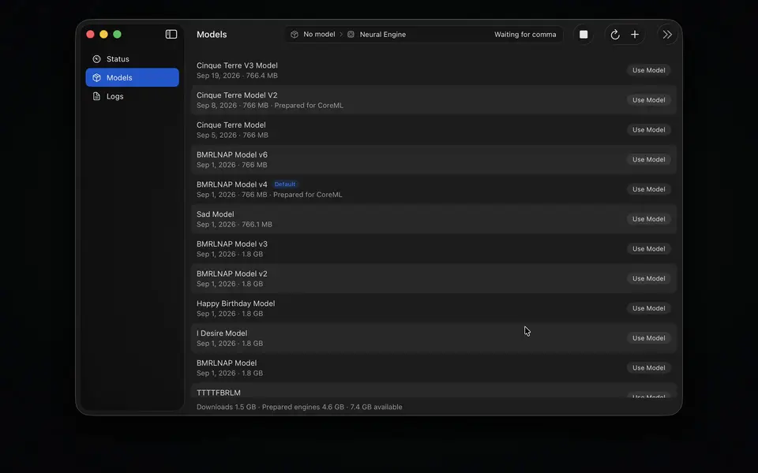
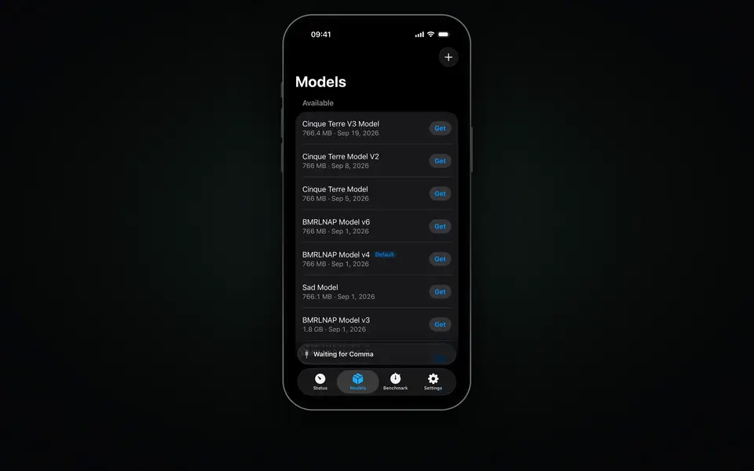
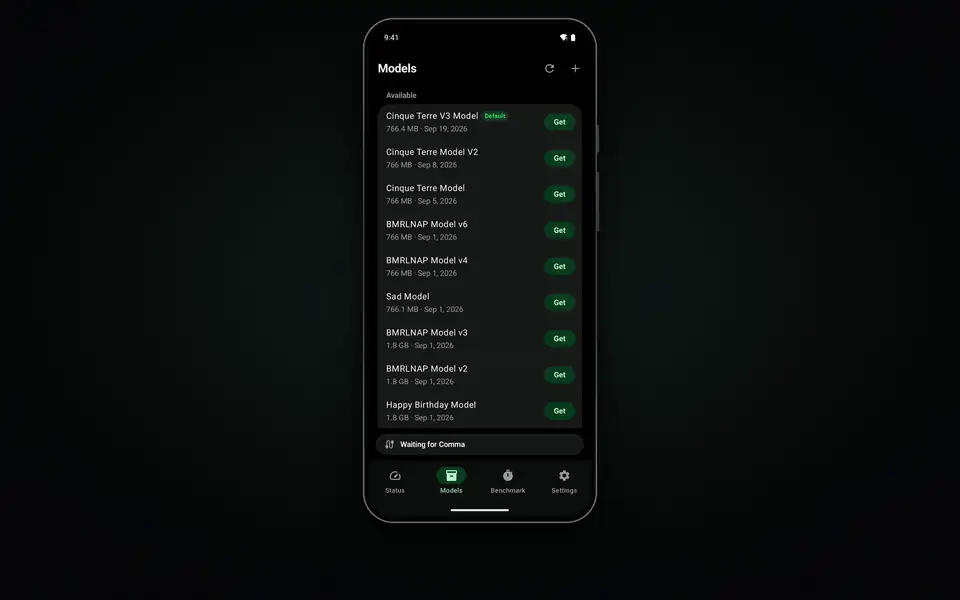

<p align="center">
  
</p>

<h1 align="center">Jetlink</h1>

<p align="center">
  Run openpilot's large driving models on a computer connected to your comma.
</p>

**Jetlink is experimental.** It needs zoompilot's
[`jetson-trt` branch](https://github.com/zoompilot/zoompilot/tree/jetson-trt);
a release that changes the protocol says so, and then the comma and Jetlink
update together.
If the link drops or lags while engaged, the comma says **TAKE CONTROL** and
stays engaged on the small model: be ready to take over.
Read the [operating limits](docs/status.md) first.

## Quick start

You need:

* A **comma 3X or comma 4**.
* A **USB 3 USB-C cable** (Jetson: USB-A to USB-C).
* **Separate power for the comma and computer**.

Set up in or out of the car, offroad. Keep the comma online and the computer
powered and awake.

1. Install Jetlink on your computer (below).
2. Do [comma setup](#comma-setup-all-platforms).
3. Wait for the comma's icon to turn green.

### Jetson

Follow the **[Jetson setup guide](docs/jetson.md)** (power, JetPack, installer).

<details>
<summary>Watch the installer</summary>

<a href="docs/images/install-demo.mp4"></a>

</details>

<details>
<summary>Watch the web page</summary>

<a href="docs/images/webui-demo.mp4"></a>

</details>

<a id="jetson-or-linux-pc"></a>

### Linux PC

Needs an NVIDIA GeForce RTX 20 series or newer GPU, on Ubuntu 22.04 or 24.04
(tested), Debian 12, Fedora, Arch or openSUSE. Run:

```bash
curl -fsSL https://raw.githubusercontent.com/zoompilot/jetlink/main/install.sh | bash
```

Installs the latest release; `jetlink update` moves to the newest. Takes 10–30
minutes. Help: [Linux setup](docs/platforms.md#linux-nvidia-gpu).

### Mac

<a href="docs/images/mac-demo.mp4"></a>

Needs Apple silicon and macOS 15 or later (16 GB memory recommended).

1. Download the Mac DMG from [Releases](https://github.com/zoompilot/jetlink/releases).
2. Drag **Jetlink** to **Applications** and open it.
3. Wait for **Waiting for comma**.
4. Keep the Mac powered and awake.

Nothing else to install: the server is built into the app.

### iPhone and iPad (experimental)

<a href="docs/images/iphone-demo.mp4"></a>

You need:

* An iPhone or iPad with USB-C on iOS or iPadOS 26.1 or later. For USB 3: an
  iPhone 15 Pro or later Pro, or an iPad Pro, Air, or mini.
* A USB 3 USB-C cable.

1. Install it from TestFlight on the iPhone or iPad. Setup:
   **[Jetlink for iPhone and iPad](docs/iphone-app.md)**.

   <a href="https://testflight.apple.com/join/DAsYk5sP"></a>
2. Open Jetlink and keep it on screen.

### Android (experimental)

<a href="docs/images/android-demo.mp4"></a>

Not yet run on a phone. You need:

* An Android phone with a Snapdragon 8 Gen 2 or newer and USB 3.
* A USB 3 hub with USB-C power pass-through, and a USB-A to USB-C cable.
* A Mac or Linux PC to build the app.

1. Build and install it: **[Jetlink for Android](docs/android-app.md)**.
2. Open Jetlink, plug in the comma, and tick **Always open** when Android asks.

## Comma setup (all platforms)

1. **Install zoompilot with Jetlink.** After resetting the comma, enter
   **`zoompilot/jetson-trt`** as the install URL (works from any fork).
   Already on zoompilot? Select **jetson-trt** in
   **Settings > Software > Target Branch > Non-Prebuilt Branches**.
   Let it finish installing, rebooting, and building.
2. **Enable Jetlink.** Set **Settings > Models > Accelerator Link** to **USB**
   (Jetson, Linux PC, Mac, Android) or **iOS** (iPhone, iPad). Offroad only. Leave
   **Big Model** at its default for the first run.
3. **Connect USB.** A USB 3 USB-C cable (Jetson: USB-A to USB-C, from its
   USB-A port). Charge-only cables won't work.
4. **Wait for green.** The home-button icon pulses while the model downloads
   and prepares (first time: about 3 minutes on a Jetson, 20 seconds on an
   M1 Pro). Stay offroad and online until it turns green.

## What to expect when driving

* The small model drives until the large model is ready.
* The large model takes over only when nothing is engaged. Ready while you
  drive engaged? The icon dims and the comma says **Big Model Ready:
  Re-engage to switch**. Turn cruise fully off (and lateral control, if it
  stays on), then engage again. No need to stop.
* **Big Model Active** chime, a second after the switch: engage on it.
* **TAKE CONTROL: Big model lost** while engaged: the link dropped or lagged.
  openpilot stays engaged on the small model. Switch back the same way.

More: [daily use and icon meanings](docs/using-jetlink.md).

## If something is wrong

| Problem | First check |
| --- | --- |
| No Accelerator Link setting | Confirm the `jetson-trt` branch in Settings > Software. |
| Server stays waiting; icon never pulses | Check the server is running. Try another USB 3 data cable. |
| Model list is empty | Connect the comma to the internet, then use Refresh Model List. |
| Setup alert or orange icon | Read the alert. Check internet, then set Accelerator Link to Off and back to USB or iOS. |
| Alert says **no warp built for this camera** | Update or reinstall the `jetson-trt` branch. |
| Comma stays on its small model after an update | Update both the comma and Jetlink: [updates](docs/releasing.md). |
| Link drops repeatedly | Check the cable, separate power, cooling, and computer sleep. |

Logs and more: [Jetson](docs/jetson.md#troubleshooting),
[Mac](docs/macos-app.md#troubleshooting),
[iPhone and iPad](docs/iphone-app.md#logs),
[Android](docs/android-app.md#logs),
[PC](docs/platforms.md#troubleshooting).

<a id="more"></a>

## Documentation

[All guides and references](docs/README.md) ·
[Daily use](docs/using-jetlink.md) ·
[Updates and rollback](docs/releasing.md) ·
[Performance and limits](docs/status.md)

## License

[MIT](LICENSE).
