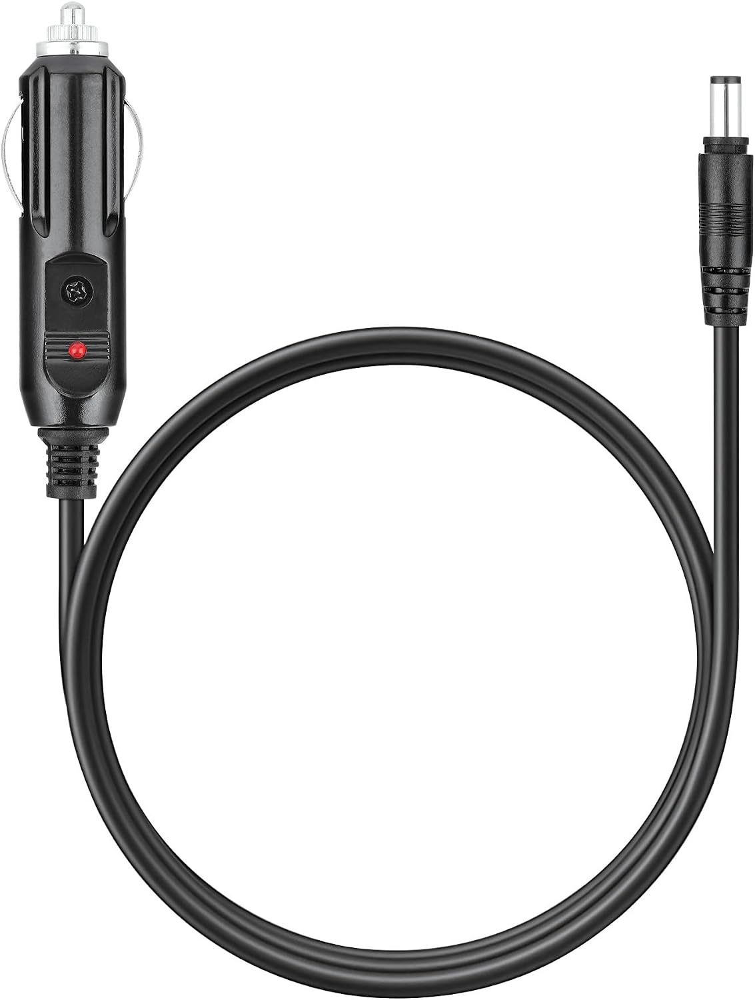

# Cables, networking, and power

For initial setup, see the [README](../README.md#quick-start), [Jetson
guide](jetson.md), or [platform setup](platforms.md).

## USB connection

Use a USB 3 A-to-C data cable. Charge-only cables do not work.

| Server | Connection to the comma's USB-C port |
| --- | --- |
| Jetson | USB-A port on the Jetson |
| Mac | USB-A port on a hub, dock, or USB-C-to-A adapter |
| Linux PC | USB-A port on the PC |

Use the USB-A connection shown above. The Jetson's USB-C port and a direct
C-to-C cable on a Mac may not connect correctly. The comma's USB-C port cannot
serve Jetlink and chestnut at the same time.

### What the comma presents

The comma presents one of two USB gadgets, chosen by its **Accelerator Link**
setting (on the comma, in the models settings):

- **USB**, for a Jetson, a Mac or a Linux PC: the plain gadget, one
  vendor-specific interface with one bulk endpoint pair, which the servers open
  through libusb (IOUSBHost on the Mac). There is no network interface.
- **iOS**, for an iPhone: a composite gadget. Interface 0 is the same vendor
  interface, and after it comes a CDC-NCM network interface, because iOS gives
  apps no access to a vendor USB device but drives a USB network adapter
  itself. The comma is `192.168.60.1` on that network and runs a DHCP server
  for it, so the phone gets a `192.168.60.x` address with no gateway and no
  DNS, keeps its own route to the internet over Wi-Fi, and dials the comma at
  `192.168.60.1:5599`. The vendor interface is never used on iOS.

Moving the setting between USB and iOS rebuilds the gadget, which is an unplug,
so the comma applies it once the car is parked.

The comma's side of this is the `jetlink.comma` package: the owner process
holds the gadget and lends modeld its endpoints, or the phone's dial, and every
root step goes through `scripts/comma/jetlink-root.sh`. See the
[installation reference](installation-reference.md#custom-usb-integrations).

### Bus speed

Latency depends on the link enumerating at USB 3 (SuperSpeed). A frame is about
460 KB: around 1 ms on USB 3 and around 11 ms on USB 2. That is why the cable
must be a USB 3 A-to-C data cable, and why a phone goes through a USB 3 hub.
On the comma, the negotiated speed is in `/sys/class/udc/*/current_speed`:
`super-speed` is USB 3 and `high-speed` is USB 2. `sudo
scripts/comma/jetlink-root.sh check` prints it along with what the gadget can
present.

### The network link on a Linux host

The comma's kernel (4.9, Qualcomm's u_ether) sends NCM transfer blocks slowly
when the host lets it pack several packets into one block. Measured on the
bench mici at SuperSpeed with a Jetson as the host, comma to host: 16 KB
blocks (the Linux default) carry 22 Mbit/s, 2 KB blocks carry 190 Mbit/s. The
other direction is unaffected (340 Mbit/s), and CPU is not the limit. So a
Linux host that wants to use the network link (a bench standing in for a
phone, or a PC over the cable network) should cap the block size:

    echo 2048 > /sys/class/net/<interface>/cdc_ncm/rx_max

`scripts/99-jetlink-host.rules` does that on plug-in. Apple's NCM driver picks
its own block size and did not show the slow path in the reference phone
measurement (393 KB up in under 19 ms). With the cap, the parked live bench on
the comma (Cinque Terre V3, 180 s, 3,416 big frames) runs at 36.4 ms p50 and
40.6 ms p99 over the network link, every frame delivered, against 28.6 and
30.3 ms over the vendor interface: about 8 ms more per frame, all of it in the
comma's send of the 393 KB frame (`bench_link.py` sees 26 ms of transport
against 8.6 ms). That is the network link's floor on this kernel; the vendor
interface stays the link for every host that can open it.

## Power requirements

Use separate power for the Jetson and comma. The Jetson's supply and cable
must support at least 25 W and tolerate voltage drops when the engine starts.
For help choosing **Always on** or **Switched**, use the
[power setup table](jetson.md#1-choose-your-power-setup).

### Recommended Jetson power setup

For the Orin Nano Super devkit, we recommend a **straight 12 V-to-DC barrel
adapter**, connected to a supply that **stays on when the ignition is off**,
with Jetson **deep sleep** enabled. An always-on 12 V accessory socket and an
adapter like the one below make this straightforward.

For the Orin Nano Super devkit, use a **5.5 mm outer / 2.5 mm inner,
center-positive** plug. Check these specifications when buying; the photo
shows the adapter style. Other Jetson carrier boards may have different
power requirements.

Check that the socket stays powered after the ignition is off, including after
any delayed shutoff. Choose **Always on** in the installer to enable deep sleep.
To change an existing setup, run `jetlink setup`.

For what happens when you park or start the car, and how battery-protection
shutdown differs from sleep, see [Choose your power setup](jetson.md#1-choose-your-power-setup).

## TCP

The comma links over USB only: the plain gadget, or for an iPhone the gadget's
network interface. The server's TCP transport (`--transport tcp`) is for
testing a server without a comma. It has no client authentication, so use a
trusted network, and Wi-Fi misses the 50 ms frame budget.

To test a server without a comma, follow [test without a
comma](platforms.md#test-without-a-comma).

For custom USB setups, see the [installation reference](installation-reference.md#custom-usb-integrations).
